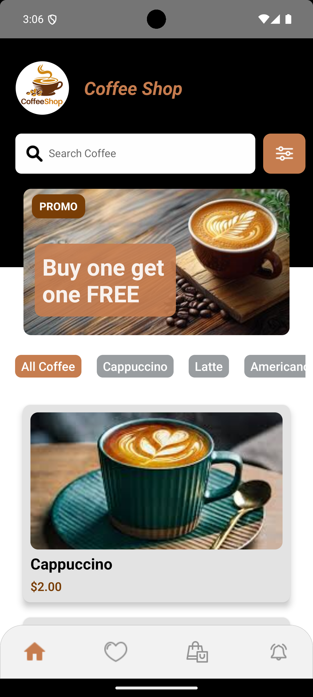
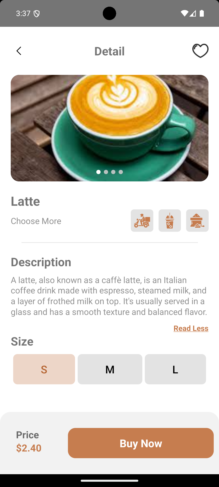
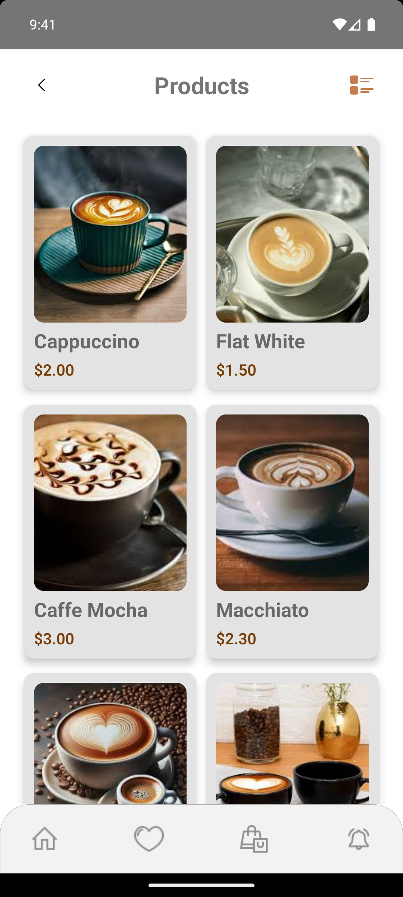
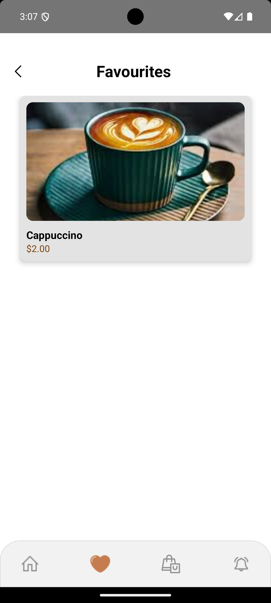
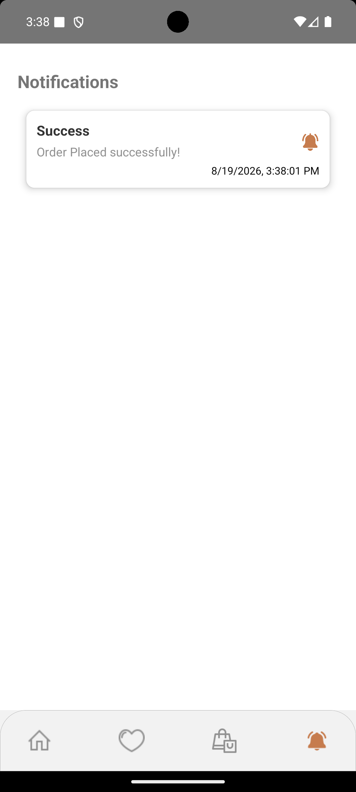
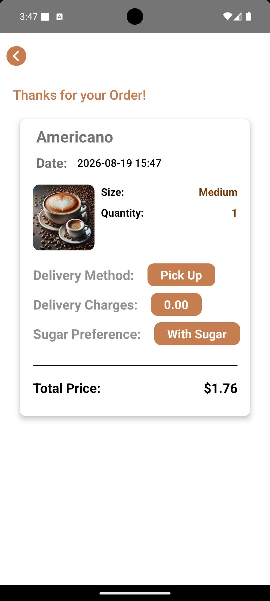

# CoffeeShop ☕

CoffeeShop is a React Native mobile application for browsing and managing coffee products.

The application provides a simple and responsive shopping experience where users can browse products, search for coffee, view product details, add products to their cart, manage quantities, and view the total price.

## Features

- 🏠 Home screen
- ☕ Browse coffee products
- 🔍 Search products
- 📋 View product details
- 🛒 Add products to cart
- ➕ Increase and decrease product quantity
- 🗑️ Remove products from cart
- 💰 Calculate cart total
- 🔐 Firebase authentication
- 🔔 Push notifications
- 📱 Android application
- 🎨 Responsive user interface
- ⚡ Smooth navigation and animations

## Tech Stack

- React Native
- TypeScript
- React Navigation
- React Native Gesture Handler
- React Native Reanimated
- React Native SVG
- React Native Screens
- React Native Safe Area Context
- Firebase Authentication
- Firebase Realtime Database
- Firebase Cloud Messaging
- Notifee
- AsyncStorage
- Lottie React Native

## Requirements

Before running the project, make sure the following are installed and configured:

- Node.js **18 or higher**
- npm
- Java JDK **17**
- Android Studio
- Android SDK
- Android SDK Build Tools
- Android Emulator or a physical Android device

### Project Versions

| Tool | Version |
|---|---|
| React Native | 0.76.3 |
| Node.js | 18 or higher |
| Java | JDK 17 |

### Check Installed Versions

```bash
node -v
npm -v
java -version
```

## Screenshots

<p align="center">
  
  
  
</p>

<p align="center">
  
  
  
</p>
